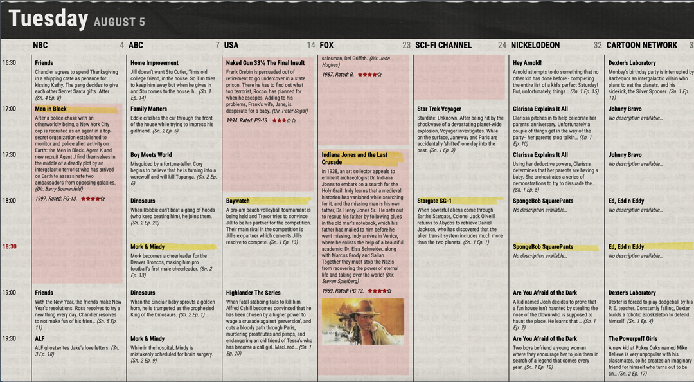

# FS42 TV Guide

A newspaper-style TV guide Preact app. that fetches FieldStation42 schedule data (for the current day only) and enriches it with TMDb movie/TV information and lots of other bells and whistles.

Built to work with the terrific [FieldStation42 project](https://github.com/shane-mason/FieldStation42) by Shane Mason.


It features: 

* an authentic-looking newspaper TV guide styling
* certificate ratings, star ratings, and screengrabs for movies
* highlighting of the current time slot and shows
* the ability to click channel names to change channel

</br>



## Installation

### 1. Update Your Raspberry Pi
```bash
sudo apt update && sudo apt upgrade -y
```

### 2. Install Node.js
```bash
# Install Node.js 18.x
curl -fsSL https://deb.nodesource.com/setup_18.x | sudo -E bash -
sudo apt install -y nodejs

# Verify installation
node --version
npm --version
```

### 3. Clone and Setup the Application
```bash
# Navigate to your preferred directory
cd /home/pi

# Clone or copy your project files
# If using git:
git clone https://github.com/sandyjmacdonald/fs42-tv-guide.git
cd fs42-tv-guide

# Or if copying files manually, create the directory structure:
mkdir fs42-tv-guide
cd fs42-tv-guide
# Copy all your project files here
```

### 4. Install Dependencies
```bash
npm install
```

## Configuration

### 1. Create Environment File
Create a `.env` file in the project root directory:

```bash
nano .env
```

### 2. Add Required Environment Variables
Add the following variables to your `.env` file:

```env
# FS42 TV API Configuration
# Use http://127.0.0.1:4242 if running on same machine as 
# FieldStation42
FS42_API_URL=http://your-fs42-server:port

# TMDb API Configuration  
TMDB_KEY=your_tmdb_api_key_here

# Server Configuration
PORT=3000

# Optional: Channels to ignore (comma-separated)
IGNORE_CHANS=Shopping Channel,Infomercials,Test Channel
```

#### Getting Your TMDb API Key:
1. Visit [The Movie Database (TMDb)](https://www.themoviedb.org/)
2. Create a free account
3. Go to Settings → API
4. Request an API key (choose "Developer" option)
5. Copy your API key to the `TMDB_KEY` variable

#### FS42 API URL:
- Replace `http://your-fs42-server:port` with your actual FS42 TV guide API endpoint
- This should be the base URL of your TV schedule data source

### 3. Program Title Naming Requirements

For the application to properly detect and enrich movies and TV shows with TMDb data, your schedule data must follow specific naming patterns:

#### TV Shows/Episodes
TV episodes must be formatted as:
```
Series Name - S##E##
```
or
```
Series Name – S##E##
```

**Examples:**
- `Breaking Bad - S01E01`
- `The Office – S03E12`
- `Game of Thrones - S08E06`

**Notes:**
- Use either a hyphen (`-`) as the separator
- Season and episode numbers should 2 digits
- The application will extract series name, season, and episode numbers
- Multi-part episodes like `S01E01-E02` are supported

#### Movies
Movies must include the release year in parentheses:
```
Movie Title (YYYY)
```

**Examples:**
- `The Shawshank Redemption (1994)`
- `Inception (2010)`
- `Top Gun: Maverick (2022)`

**Notes:**
- The year must be exactly 4 digits in parentheses at the end
- The application will extract movie title and year for TMDb lookup
- Movies will display star ratings and additional metadata

#### Special Programming
Programs that don't match these patterns will be treated as generic programming:
- Live events, news, sports
- Specials without standard episode formatting
- Local programming

**Off-Air Detection:**
- Programs titled exactly `offair` (case-insensitive) will be styled as off-air blocks
- Consecutive off-air blocks will be automatically merged

### 4. File Permissions
Ensure the application has proper permissions:

```bash
chmod +x server.js
chmod 644 .env
```

## Running the Application

### Manual Start
```bash
# Start the server
node server.js
```

The application will be available at:
- Local access: `http://localhost:3000`
- Network access: `http://[raspberry-pi-ip]:3000`

To find your Raspberry Pi's IP address:
```bash
hostname -I
```

### Auto-Start on Boot (Optional)

Create a systemd service to automatically start the application:

```bash
# Create service file
sudo nano /etc/systemd/system/fs42-tv-guide.service
```

Add the following content:
```ini
[Unit]
Description=TV Guide Application
After=network.target

[Service]
Type=simple
User=pi
WorkingDirectory=/home/pi/fs42-tv-guide
ExecStart=/usr/bin/node server.js
Restart=always
RestartSec=10
Environment=NODE_ENV=production

[Install]
WantedBy=multi-user.target
```

Enable and start the service:
```bash
# Reload systemd
sudo systemctl daemon-reload

# Enable auto-start
sudo systemctl enable fs42-tv-guide

# Start the service
sudo systemctl start fs42-tv-guide

# Check status
sudo systemctl status fs42-tv-guide
```

## License

This project is licensed under the MIT License - see the [LICENSE](LICENSE) file for details.